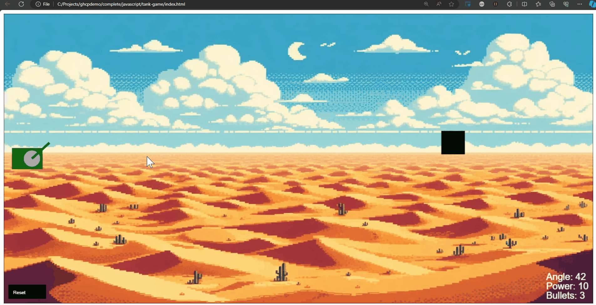

# Tank Game Challenge:

The goal of this challenge is to apply what you've learned by using GitHub Copilot chat. Your task is to come up with the right questions to ask Copilot to help you complete this basic JavaScript game based on an old game "Tanks".

## Why Do This Challenge?

Dive into this tank game challenge to sharpen your skills in guiding GitHub Copilot, your AI pair programmer. Just like building any app, the game involves a user interface, input handling, and event outcomes. This isn't just about coding—it's about learning to communicate effectively with AI to enhance your development process. Perfect your prompts, get precise suggestions, and translate this practice into tackling real-world projects with increased efficiency.

## The Game 

## Objective of the game:
To play the game, the player must use the Up/Down keys to move the angle of the tank's cannon, the Left/Right keys to adjust the power, and press the Space Bar to shoot. The goal is to hit the black box (the target) before the bullets run out (3 by default).

The bullet limit can be adjusted by changing the `bulletCount` property in the tank object, found in the `resetGame()` function.

## Controls:
- `Up Arrow` - Move the tank cannon angle up.
- `Down Arrow` - Move the tank cannon angle down.
- `Left Arrow` - Decrease the tank's cannon power.
- `Right Arrow` - Increase the tank's cannon power.
- `Space Bar` - Shoot the bullet.

## Running the Game
To run the game, open the `exercise\javascript\tank-game\index.html` file in a browser. The game will start automatically.

## Coding Challenge
Complete the following challenges using GitHub Copilot chat to fix or revise the tankgame.js JavaScript code.

The `tankgame.js` exercise file is found in the `exercise\javascript\tank-game` directory.

> Hint: Before asking Copilot, highlight the entire contents of the `tankgame.js` file. Then start writing you questions in the chat. 

> Remember: If you don't get the response you were expecting, try rephrasing your prompt. Use specific instructions to achieve one thing at a time, then iterate, iterate, iterate!

## Main Challenge:

> Optional: Use a timer application to track the time spent completing the main challenge.

1.) Add physics to the bullet trajectory with configurable air resistance and gravity. Currently, the bullet travels on a straight line. Adding physics to the bullet will make it more realistic and challenging to hit the target. (refer to GIF above.)

> This may sound complex, but it's actually really simple. You can start by asking Copilot how to add physics to the bullet trajectory. Then ask how to add air resistance and gravity to the bullet. 

2.) Change the fill color of the Tank rectangle to green. Then the circle fill with dark gray. Change the color of the bullet to red.

3.) Change the playable canvas area to use the entire browser window. When the window is resized, the canvas should resize accordingly.

4.) Add a background image to the canvas. Image is available at `exercise\javascript\tank-game\image\background.jpg`. Instead of an "X", display the `boom.png` image when the bullet hits the target.

5.) Add a function that detects if the bullet leaves the canvas area. Before displaying "You Lose", the bullet should be off the canvas.

## Extra Challenge
If you're feeling adventurous, you can delete the entire `tankgame.js` file and ask Copilot to write the entire code from scratch. Here's a reference prompt:

`Let's recreate the classic game "Tank" in JavaScript. The objective of the game is to hit a target represented by a black box. The tank is represented by a cicle and a line the extends from the center of the circle outwards. The line represents the cannon and can be adjusted using the up/down arrow. The user can control the cannon angle and the power. Pressing Spacebar will fire the cannon. Display the angle and power at the bottom right corner. Generate the guide to create this step-by-step and the JS code.`

Feel free to change the prompt to your liking. You can even change the game mechanics if you want, like adding a score instead of a bullet limit.

> Note: Due to the probabilistic nature of Copilot, the code generated may not be the same as the original code in this repository. However, the code should be functional and achieve the same goal.

## Developed using plain English

The complete working code of the game is under `completed/javascript/tank-game/tankgame.js` and was developed primarily **with the assistance of GitHub Copilot Chat**. Only the comments were added manually.

Time taken to develop: 1 hour 30 minutes (approx.)

## Image by DALL-E 3
The backround image is created by OpenAI's DALL-E 3 model.